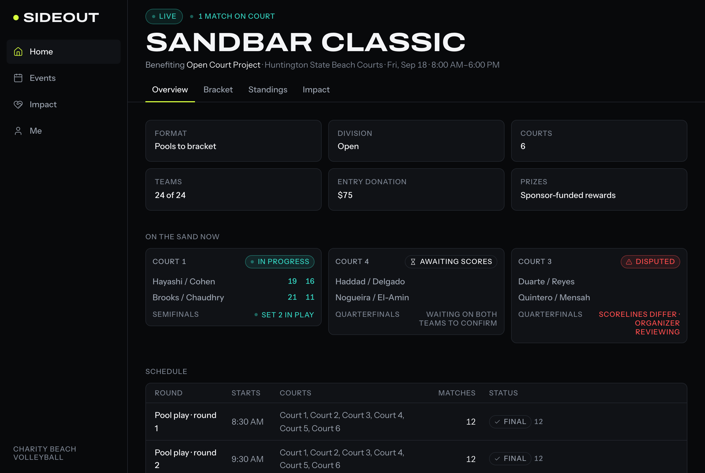

# Sideout

Sideout runs charity beach volleyball tournaments: organizers build an event, teams register with a donation to the event's beneficiary, both teams confirm every score from their own phones, and the competition layer — tournament entry, rewards, settlement, compliance — is Lucra's, reached through their Web SDK in the browser and their REST API from my server.



The build brief I worked from is [`docs/build-spec.md`](docs/build-spec.md). Everything it marks OPEN is in [`docs/open-questions.md`](docs/open-questions.md) with the fallback I implemented; the Lucra write path is drawn out in [`docs/lucra-integration.md`](docs/lucra-integration.md); what a host needs, and how the public demo on Railway is deployed and redeployed, is in [`docs/deploy.md`](docs/deploy.md).

## 60-second quickstart

Node 22 (`.nvmrc`) and npm. No Lucra credentials, no `.env` file.

```sh
npm i
npm run seed     # creates ./data/sideout.db, applies the migrations, loads the demo data
npm run dev      # http://localhost:3000
```

`LUCRA_MODE=mock` is the default: an in-process Lucra with the documented endpoints, error bodies and webhooks, plus a stand-in for the Web SDK in the browser, so every flow runs end to end without an account. `GET /health` reports the build sha, the Lucra mode, the pinned SDK version and the installed one, which matcher reading is active, where the session secret came from, whether the dev sign-in route is compiled in, and the migration state.

The seed is deterministic: one beneficiary, 48 players in every verification state, and three events — one live (24 teams, pools finished, a semifinal in progress, a disputed quarterfinal, one waiting on scores, a first-round bye), one open for registration, one settled with rewards. Every number on a screen is derived from those rows.

To sign in during development, `POST /api/auth/request-code` returns the one-time code in the response as `devCode` (there is no SMS provider yet; see [`docs/deploy.md`](docs/deploy.md)), and `POST /api/dev/login` signs you in as any seeded user by phone. Seeded organizers can open the console at `/organizer/events`. The public demo instead signs visitors in through the demo-accounts picker on `/sign-in` (`DEMO_ACCOUNTS=true`, mock mode only; see [`docs/deploy.md`](docs/deploy.md), "Public demo").

## Architecture

```
┌──────────────────────────────────────────────────────┐
│  Browser (Next.js client, installable PWA)           │
│   • Sideout UI                                       │
│   • Lucra Web SDK, init: tenantId + WEB key          │
│     - launches identity / wallet / entry flows       │
│   • service worker + IndexedDB score outbox          │
└───────────────┬──────────────────────────────────────┘
                │  my own API only; never the Lucra
                │  backend key from the client
┌───────────────▼──────────────────────────────────────┐
│  Next.js server (route handlers, Node runtime)       │
│   • tournament + bracket domain logic (pure)         │
│   • score consensus state machine  ◄── trust boundary│
│   • Lucra adapter (mock | sandbox | production)      │
│   • webhook receiver                                 │
│   • SQLite (Drizzle + better-sqlite3), audit log     │
└───────────────┬──────────────────────────────────────┘
                │  X-Lucra-Api-Key (BACKEND key, server only)
┌───────────────▼──────────────────────────────────────┐
│  Lucra REST API  /  Lucra mock (src/lucra/mock.ts)   │
└──────────────────────────────────────────────────────┘
```

Three rules I do not bend, each with the test that keeps it true:

1. **The BACKEND Lucra key exists only in server environment variables and is never serialized into any response.** The WEB key and `tenantId` are the only Lucra credentials that reach the browser. `src/env.ts` is `server-only`; `npm run test:bundle` builds with a sentinel key and fails if the key, or its variable name, appears anywhere under `.next/static`. The client's redaction is tested, and `/admin/lucra` shows every request with the header masked.
2. **No score reaches Lucra directly from a client.** Every score goes through the consensus state machine first (next section). Every Lucra write starts with `assertMayWriteToLucra`, which throws unless the consensus is `agreed` with a minted idempotency key; `src/domain/consensus.test.ts` walks every state through the gate and `src/server/lucra.test.ts` proves a replay is refused before a request is built.
3. **The Lucra adapter is the only module that makes outbound Lucra calls.** ESLint refuses `@/lucra/client`, `@/lucra/mock` and any `fetch` naming a Lucra host outside `src/lucra/`, and `src/lucra/import-boundary.test.ts` proves the rule fires. In the browser the same holds for the SDK: only `LucraGate` imports it.

## How scores become prizes

A number typed into a phone on the sand is a claim, not a result. Lucra ingests a score it cannot verify, and if I forwarded whatever one team typed, one team could decide the outcome of a match that moves a prize. So a score only becomes a result when two independent parties say the same thing, and the server — not the phone — decides whether they did.

Each match has one consensus row, and it moves like this:

```
awaiting_first ──first_submission──► awaiting_second ──matching_submission──► agreed
                                            │                                    │
                                            └──conflicting_submission──► disputed ┘
                                                                            (organizer_resolution)

agreed ──lucra_submit──► submitting ──► accepted | partial | rejected
                              ▲                        │
                              └────organizer_retry─────┘
```

- A player submits their team's scoreline from their own side. The server works out which team they play for from the roster (never from the request), refuses anything that is not a legal beach volleyball result — sets to 21, a deciding set to 15, win by two, best of one or three — with a message naming the set, and canonicalizes what is left to the match's orientation and hashes it.
- The first legal submission takes the consensus to `awaiting_second`. The second has to come from the *other* team; two submissions from one team only replace each other, and a resubmission supersedes the earlier row rather than editing it.
- If the two hashes are equal the consensus is `agreed`: the sets are written, the match is `final`, the winner advances, and one idempotency key is minted for every Lucra attempt that follows. If they differ, the consensus is `disputed`: both readings are shown side by side with the set that differs marked, nobody is called wrong, and only an organizer can settle it, with an attributed scoreline (or by forfeiting one side, in which case nothing is ever written to Lucra for that match).
- Only `agreed` can be written to Lucra, and the write itself is recorded: one attempt row per try with the exact request and response, and the consensus ends `accepted`, `partial` (Lucra accepted the batch but listed a matchup it did not apply) or `rejected`. An organizer can retry the last two under the same key; a replay produces exactly one accepted row.
- A tournament never settles on its own, and not on `attemptFinished`. The organizer closes it in two steps over a frozen preview of the final standings and projected rewards, blocked while any match is unresolved (and the blockers are named), and only that close sends the settlement call.

Every transition is a row in `audit_log` with its actor. The pure machine is `src/domain/consensus.ts`; the transactions are `src/server/consensus.ts`; the Lucra side is `src/server/lucra.ts` and [`docs/lucra-integration.md`](docs/lucra-integration.md).

Two ledgers never meet: a team's entry fee is a charitable donation through a stub provider (`donations`), and prizes are sponsor-funded rewards settled by Lucra (`rewards`, `sponsors`). There is no foreign key between them and no query joins them, so a prize can never be computed from donation revenue.

## The matcher, and which published examples reproduce

Lucra's `user-score-by-metadata` endpoint resolves a matchup by scoring a metadata query against each record, and the documentation gives the algorithm in prose and then five worked examples plus a weight table. I ported the algorithm (`src/lucra/matcher.ts`) and found that two of the examples contradict the prose, so the mock runs one of two readings: `literal` (the prose, default) or `doc-examples` (the examples). `src/lucra/matcher.test.ts` asserts every row below exactly as written, and `/health` reports which reading is active.

| Published example | Documented | `literal` | `doc-examples` |
|---|---|---|---|
| 1 — a reserved field (`externalId`) silences every other field | 1, match | 1, match — reproduces | 1, match — reproduces |
| 2 — exact string match | 1, match | 1, match — reproduces | 1, match — reproduces |
| 3 — a fully equal array scored 1 (the prose gives 0.7 × overlap) | 1, match | **0.7, no match — does not reproduce** | 1, match — reproduces |
| 4 — combined matching | 2.35, match | 2.35, match — reproduces | 2.35, match — reproduces |
| 5 — `"summer-league"` vs `"summer-tournament"` called a 0.5 partial | 0.5, no match | **0, no match — verdict agrees, score does not** | 0.5, no match — reproduces |
| weight table — array intersection 2 of 3 | 0.47, no match | 0.47, no match — reproduces | 0.47, no match — reproduces |

Sideout itself never depends on the difference: every write targets a `matchupId` or a sole-key `externalId`, which both readings resolve identically, and a loose-metadata target throws before any network call (`StrictMatchupTarget`).

## Open questions

The spec's §17 list. I did not guess at any of these; each has a fallback in code marked `// OPEN:` and a row in [`docs/open-questions.md`](docs/open-questions.md) with the reasoning. In one line each:

1. **Sandbox credentials** are issued by a Lucra representative; there is no self-serve path. Fallback: `LUCRA_MODE=mock` with a faithful in-process Lucra, and a stand-in for the Web SDK in the browser.
2. **Forge vs legacy REST.** The public reference is marked legacy. Fallback: the legacy shapes, isolated in `src/lucra/endpoints.ts` and `types.ts` so a migration is those two files.
3. **Webhook signature scheme** is not published. Fallback: HMAC-SHA256 over the raw body in one function, `src/lucra/webhook-signature.ts`.
4. **Idempotency.** Whether Lucra honours a first-class key on score writes is unknown. Fallback: my own key, minted once per agreed consensus, enforced locally and echoed in `metadata`.
5. **`gameId` and `locationId`** for a sport whose courts are not permanent. Fallback: one constant `gameId` (`SIDEOUT_BEACH_2V2`), and `locationId` nullable and left null, omitted from the write.
6. **Closing tournaments via API.** The docs reference an API and a console. Fallback: the documented complete call from the organizer's close, with a read-back before and after, so a close from Lucra's console is recognized and never repeated.
7. **State coverage.** Lucra's surfaces say 42, 43 and 44 states in different places. Fallback: never in copy; `LUCRA_STATE_COVERAGE` is `null` and screens say "where Lucra is available".
8. **Charitable gaming interaction** with the skill-contest framework. Fallback: no copy anywhere implies legal clearance (`src/copy-audit.test.ts` keeps it that way), and the donation and reward ledgers never touch.
9. **Score attestation.** Whether Lucra wants a partner-side dual-confirmation contract. Fallback: built and enforced on my side regardless (the section above), with every submission row and transition kept so there is a full trail to sign over later.

## What is not built

From the spec's non-goals, on purpose: no live video or clips; no feed, comments, messages or followers; no native apps (web only, installable as a PWA); no payment processing of my own — Lucra is the merchant of record for competition funds and charitable donations go through a documented stub provider; no KYC, identity, geolocation or AML logic of my own — I launch Lucra's flows and store only a state enum; no ranking beyond what a tournament needs; no white-labeling; and no real money in production.

**`FEATURE_REAL_MONEY=false`.** The real-money head-to-head code path exists (the wallet's add-funds and withdraw launches in `LucraGate`, the `real_money` prize kind) and is gated behind this flag, which is off and should stay off. Nothing else reads it.

Also not built, and refused honestly rather than half-done: `double_elim` is in the format enum but the draw engine answers `unsupported_format`; phone sign-in has no SMS provider yet, so a production build answers `503 sms_unavailable` to a code request until one implements `SmsSender`. The full list of follow-ups is at the bottom of [`docs/open-questions.md`](docs/open-questions.md).

## Running the checks

| Command | What it does |
|---|---|
| `npm run typecheck` | `next typegen`, then `tsc --noEmit` — strict, no `any` |
| `npm run lint` | ESLint with warnings as errors, including the import boundaries above |
| `npm test` | Vitest: the domain, every route, the consensus machine, the Lucra layer, the matcher table, the motion and offline code, the copy audit, the token contrast checks |
| `npm run test:bundle` | A sandbox build with sentinel secrets, then a scan of `.next/static` for the backend key, the webhook secret, a crypto polyfill, the mock stand-in, and of `.next/server` for the dev and mock routes |
| `npm run build` | The production build |
| `npm run test:e2e` | Playwright against a seeded production server it starts itself (`npx playwright install chromium` first): the player and organizer flows, the offline outbox, axe at 390 and 1280, keyboard operability, and a screenshot of every screen at 390/768/1280 |

CI runs all of them on every pull request (`.github/workflows/ci.yml`). The README screenshots come from `scripts/screenshots.ts` against that same seeded server.
